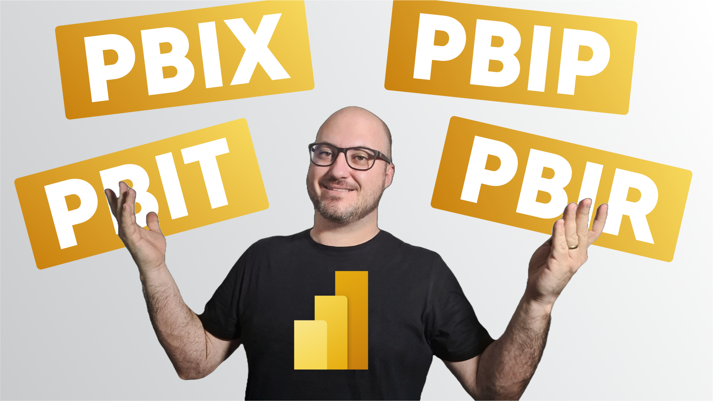

[](https://github.com/alisonpezzott/pbi_file_formats/blob/main/LICENSE) 

## Power BI Format Files

  

This repository aims to clarify the main points about the different file formats used in Power BI Desktop.

Video: [Power BI File Formats - Introduction to PBIR](https://youtu.be/cG8fT6W_PpE)


## Useful Links

Below are the links I used as a basis for study in this video:


[Power BI Desktop projects (PREVIEW)](https://learn.microsoft.com/en-us/power-bi/developer/projects/projects-overview)
  
[Power BI Desktop project semantic model folder](https://learn.microsoft.com/en-us/power-bi/developer/projects/projects-dataset)   

[TMDL Format](https://learn.microsoft.com/en-us/power-bi/developer/projects/projects-dataset#tmdl-format)  

[PBIR Format](https://learn.microsoft.com/en-us/power-bi/developer/projects/projects-report#pbir-format)  
  
[Deploy a Power BI project using Fabric APIs](https://learn.microsoft.com/en-us/rest/api/fabric/articles/get-started/deploy-project)
  
[Fabric Power Shell PBIP APIs](https://github.com/microsoft/Analysis-Services/blob/master/pbidevmode/fabricps-pbip/README.md)


## File Formats

Below is a summary table of the file formats presented in the video.  

| Format     | Characteristics                                      | Semantic Model                                       | Report                                         | Data                                        | Versioning                                             | Publishing Methods                                  |
|------------|----------------------------------------------------|----------------------------------------------------|------------------------------------------------|-----------------------------------------------|------------------------------------------------------|------------------------------------------------------|
| PBIX       | A single encapsulated file       | Included in the file                              | Included in the file                          | Imported into the file                      | SharePoint or One Drive for Business | PBI Desktop<br>Upload to Workspace<br>APIs     |
| PBIT       | Just a template to generate a pbix  | Included in the file <br>Metadata                 | Included in the file <br>Metadata             | Absent<br>Requires a new load               | Not applicable                                      | Not applicable                                      |
| PBIP (TMSL) | Files structured in project folders              | model.bim                                        | report.json                                   | cache.abf<br>Not trackable due to .gitignore | Fully supported                                    | PBI Desktop<br>Git integration<br>APIs |
| PBIP (TMDL) | Files structured in project folders              | definition folder<br> | report.json                                   | cache.abf<br>Not trackable due to .gitignore | Fully supported                                    | PBI Desktop<br>Git integration<br>APIs |
| PBIR       | Files structured in project folders              | definition folder | definition folder        | cache.abf<br>Not trackable due to .gitignore | Fully supported<br>Improved report versioning      | PBI Desktop<br>Git Integration<br>APIs |


## .gitIgnore

When saving a file with the PBIP format, a .gitignore file is always created with the following content:

```
**/.pbi/localSettings.json
**/.pbi/cache.abf
```

## definition.pbir

Contains the overall definition of a report and core settings. This file also holds the reference to the semantic model used by the report. Power BI Desktop can open a pbir file directly, just the same as if the report were opened from a pbip file. Opening a pbir also opens the semantic model alongside if there's a relative reference using byPath.

Example definition.pbir:

```json
{
  "version": "4.0",
  "datasetReference": {
    "byPath": {
      "path": "../Sales.Dataset"
    },
    "byConnection": null
  }
}
```

The definition includes the datasetReference property, which references the semantic model used in the report. The reference can be either:

byPath - Specifies a relative path to the target semantic model folder. Absolute paths aren't supported. A forward slash (/) is used as a folder separator. When used, Power BI Desktop also opens the semantic model in full edit mode.

byConnection - Specifies a remote semantic model in the Power BI service by using a connection string. When a byConnection reference is used, Power BI Desktop doesn't open the semantic model in edit mode.

Using a byConnection reference, the following properties must be specified:

|Property|Description|
|:--|:--|
|connectionString|The connection string referring to the remote semantic model.|
|pbiModelDatabaseName|The remote semantic model ID.|
|connectionType	Type of connection.|For service remote semantic model, this value should be pbiServiceXmlaStyleLive.|
|pbiModelVirtualServerName|An internal property that should have the value, sobe_wowvirtualserver.|  


Example using byConnection:  

```json
{
  "version": "4.0",
  "datasetReference": {
    "byPath": null,
    "byConnection": {
      "connectionString": "Data Source=powerbi://api.powerbi.com/v1.0/myorg/[WorkpaceName];Initial Catalog=[SemanticModelName];Integrated Security=ClaimsToken",
      "pbiServiceModelId": null,
      "pbiModelVirtualServerName": "sobe_wowvirtualserver",
      "pbiModelDatabaseName": "[Semantic Model Id]",
      "connectionType": "pbiServiceXmlaStyleLive",
      "name": "EntityDataSource"
    }
  }
}
```

## PBIR folder and files  


PBIR naming convention
All names inside the square brackets ([]) in the preceding table follow a default naming convention but can be renamed to more user-friendly names. By default, pages, visuals, and bookmarks use their report object name as their file or folder name. These object names are initially a 20-character unique identifier, such as '90c2e07d8e84e7d5c026'.


## Structure of each project types

Below is a diagram of the file structures examples for better visualization of each file format.

### \*.pbip with TMSL  

```
📂 Project
   ├ 📂 Adventure Works.Report
   │    ├ 📂 .pbi
   │    │    └ localSettings.json
   │    ├ 📂 StaticResources
   │    │    ├ 📂 RegisteredResources
   │    │    │    └ based_github_nordtheme9185362298209934.json
   │    │    └ 📂 SharedResources
   │    │         └ 📂 BaseThemes
   │    │              └ CY24SU10.json
   │    ├ .platform
   │    ├ definition.pbir  
   │    └ report.json  
   ├ 📂 Adventure Works.SemanticModel
   │    ├ 📂 .pbi
   │    │    ├ cache.abf
   │    │    ├ editorSettings.json
   │    │    └ localSettings.json
   │    ├ .platform
   │    ├ definition.pbism
   │    ├ diagramLayout.json
   │    └ model.bim
   └ 📂 Adventure Works.pbip
```  


### \*.pbip with TMDL

```
📂 Project
   ├ 📂 Adventure Works.Report
   │    ├ 📂 .pbi
   │    │    └ localSettings.json
   │    ├ 📂 StaticResources
   │    │    ├ 📂 RegisteredResources
   │    │    │    └ based_github_nordtheme9185362298209934.json
   │    │    └ 📂 SharedResources
   │    │         └ 📂 BaseThemes
   │    │              └ CY24SU10.json
   │    ├ .platform
   │    ├ definition.pbir  
   │    └ report.json  
   ├ 📂 Adventure Works.SemanticModel
   │    ├ 📂 .pbi
   │    │    ├ cache.abf
   │    │    ├ editorSettings.json
   │    │    └ localSettings.json
   │    ├ 📂 defintion
   │    │    ├ 📂 cultures
   │    │    │    └ pt-BR.tmdl
   │    │    ├ 📂 tables
   │    │    │    ├ DimCustomer.tmdl
   │    │    │    ├ DimDate.tmdl
   │    │    │    ├ DimProducts.tmdl
   │    │    │    ├ DimReseller.tmdl
   │    │    │    ├ DimSalesTerritory.tmdl
   │    │    │    ├ FactSales.tmdl
   │    │    │    └ ModelMeasures.tmdl
   │    │    ├ database.tmdl
   │    │    ├ expressions.tmdl
   │    │    ├ model.tmdl
   │    │    └ relationships.tmdl
   │    ├ .platform
   │    ├ definition.pbism
   │    └ diagramLayout.json
   └ 📂 Adventure Works.pbip
```  


### \*.pbir  

```
📂 Project
   ├ 📂 Adventure Works.Report
   │    ├ 📂 .pbi
   │    │    └ localSettings.json
   │    ├ 📂 definition
   │    │    ├ 📂 pages
   │    │    │    ├ 📂 Channel
   │    │    │    │    ├ 📂 visuals
   │    │    │    │    │    ├ 📂 6fec997fe119a35953ad
   │    │    │    │    │    │    └ visual.json
   │    │    │    │    │    ├ 📂 8a08fd6bf63d32c4a76f
   │    │    │    │    │    │    └ visual.json
   │    │    │    │    │    ├ 📂 17693be68ea5dc027d7f
   │    │    │    │    │    │    └ visual.json
   │    │    │    │    │    └ 📂 babca6ecb4152335ec58
   │    │    │    │    │         └ visual.json
   │    │    │    │    └ page.json
   │    │    │    ├ 📂 Country
   │    │    │    │    ├ 📂 visuals
   │    │    │    │    │    ├ 📂 8a08fd6bf63d32c4a76g
   │    │    │    │    │    │    └ visual.json
   │    │    │    │    │    ├ 📂 8a045467be336dde1d3c
   │    │    │    │    │    │    └ visual.json
   │    │    │    │    │    ├ 📂 3519728a5aadb94bc3d8
   │    │    │    │    │    │    └ visual.json
   │    │    │    │    │    └ 📂 babca6ecb4152335ec59
   │    │    │    │    │         └ visual.json
   │    │    │    │    └ page.json
   │    │    │    ├ 📂 Products
   │    │    │    │    ├ 📂 visuals
   │    │    │    │    │    ├ 📂 6fec997fe119a35953ae
   │    │    │    │    │    │    └ visual.json
   │    │    │    │    │    ├ 📂 8a08fd6bf63d32c4a76h
   │    │    │    │    │    │    └ visual.json
   │    │    │    │    │    ├ 📂 17693be68ea5dc027d7g
   │    │    │    │    │    │    └ visual.json
   │    │    │    │    │    └ 📂 babca6ecb4152335ec60
   │    │    │    │    │         └ visual.json
   │    │    │    │    └ page.json
   │    │    │    └ pages.json
   │    │    ├ report.json
   │    │    └ version.json
   │    ├ 📂 StaticResources
   │    │    ├ 📂 RegisteredResources
   │    │    │    └ based_github_nordtheme9185362298209934.json
   │    │    └ 📂 SharedResources
   │    │         └ 📂 BaseThemes
   │    │              └ CY24SU10.json
   │    ├ .platform
   │    └ definition.pbir  
   ├ 📂 Adventure Works.SemanticModel
   │    ├ 📂 .pbi
   │    │    ├ cache.abf
   │    │    ├ editorSettings.json
   │    │    └ localSettings.json
   │    ├ 📂 defintion
   │    │    ├ 📂 cultures
   │    │    │    └ pt-BR.tmdl
   │    │    ├ 📂 tables
   │    │    │    ├ DimCustomer.tmdl
   │    │    │    ├ DimDate.tmdl
   │    │    │    ├ DimProducts.tmdl
   │    │    │    ├ DimReseller.tmdl
   │    │    │    ├ DimSalesTerritory.tmdl
   │    │    │    ├ FactSales.tmdl
   │    │    │    └ ModelMeasures.tmdl
   │    │    ├ database.tmdl
   │    │    ├ expressions.tmdl
   │    │    ├ model.tmdl
   │    │    └ relationships.tmdl
   │    ├ .platform
   │    ├ definition.pbism
   │    └ diagramLayout.json
   └ 📂 Adventure Works.pbip
```  

